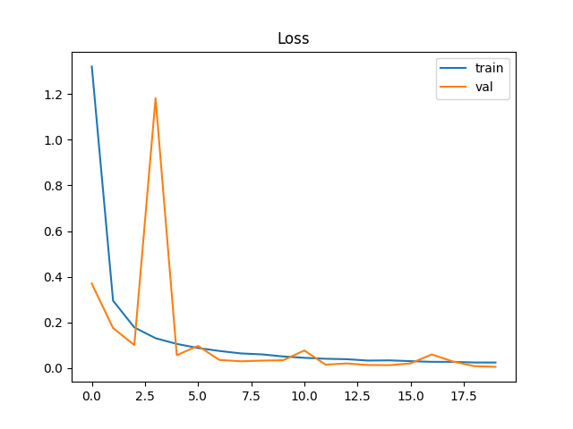
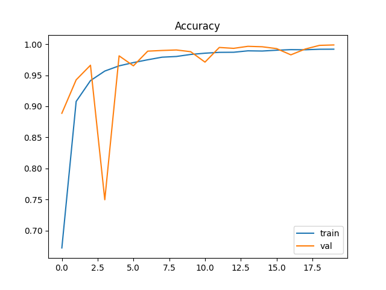
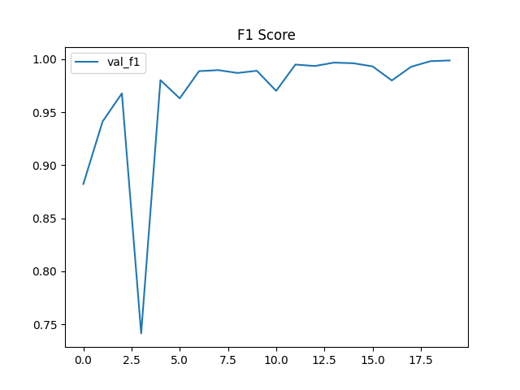

# Fruit Classifier 360

## Князев Даниил Дмитриевич

## Постановка задачи

Разработка системы автоматической классификации фруктов по изображениям. Модель должна определять, какой именно фрукт (или овощ) находится на картинке. Это классическая задача компьютерного зрения, которая может быть полезна в розничной торговле, сельском хозяйстве или просто для развлечения — например, чтобы узнать, что за фрукт лежит перед вами.

## Формат входных и выходных данных

**Вход:**

- RGB-изображение фрукта (любого размера, но модель ожидает 100×100 пикселей).
- На этапе инференса изображение подаётся в виде файла (поддерживаются `.jpg`, `.png` и др.).

**Выход:**

- Предсказанный класс фрукта (строка, например `"Apple"`).
- Вероятности для всех классов (словарь вида `{"Apple": 0.95, "Banana": 0.03, ...}`).
- В формате JSON для HTTP-сервиса.

## Метрики

Для оценки качества модели выбраны стандартные метрики многоклассовой классификации:

1. **Accuracy** — доля правильных ответов. Классы в датасете сбалансированы, поэтому accuracy хорошо отражает общее качество.
2. **F1-score (macro)** — усреднённое гармоническое среднее precision и recall по всем классам. Позволяет учесть возможные дисбалансы и штрафует за плохое распознавание редких классов.
3. **Confusion Matrix** — матрица ошибок, помогающая визуально оценить, какие классы модель чаще путает.

Ожидаемые значения после 20 эпох обучения:

- Accuracy ≥ 0.95
- F1-score ≥ 0.96

## Валидация и тест

Датасет Fruits-360 уже разбит на обучающую (`Training`) и тестовую (`Test`) выборки. Дополнительно мы выделяем 15% от обучающей выборки для валидации (с помощью `random_split`). Это позволяет контролировать переобучение и выбирать лучшую модель по метрикам на валидации.

Для воспроизводимости:

- зафиксирован seed = 42
- в Trainer включён флаг `deterministic=True`
- разделение на train/val выполняется с тем же seed

## Датасеты

**Fruits-360** — реальный датасет изображений фруктов и овощей.

- Источник: [Kaggle](https://www.kaggle.com/datasets/moltean/fruits) / [GitHub](https://github.com/fruits-360/fruits-360-100x100)
- Количество изображений: ≈170 000
- Количество классов: 250 (включая яблоки, бананы, апельсины, огурцы, помидоры и т.д.)
- Размер: около 800 МБ
- Особенности:
  - Все изображения приведены к размеру 100×100 пикселей
  - Единый белый фон
  - Хорошая сегментация объектов
  - Классы сбалансированы (примерно по 500–1000 изображений на класс)

Мы используем полную версию датасета, без фильтрации, чтобы задача была более реалистичной.

## Моделирование

### Бейзлайн

В качестве простейшего решения использован Transfer Learning с предобученной **ResNet18** (веса ImageNet).

- Последний полносвязный слой заменён на новый с числом выходов, равным количеству классов (131).
- Все слои, кроме последнего, заморожены.
- Обучение: 5 эпох, оптимизатор Adam, lr=0.001.

Ожидаемая точность бейзлайна: около 0.85–0.90.

### Основная модель

**CustomCNN** — свёрточная сеть, спроектированная специально для задачи классификации небольших изображений.

Архитектура:

- 4 свёрточных блока (Conv2d + BatchNorm + ReLU + MaxPooling)
- После свёрток — Global Average Pooling (GAP) вместо полносвязных слоёв, что уменьшает число параметров и борется с переобучением
- Dropout (0.3) перед выходным слоем
- Выходной слой: Linear(256 → 131) + Softmax

Обучение:

- Оптимизатор: Adam
- Learning rate: 1e-3 с уменьшением на плато (ReduceLROnPlateau)
- Loss: CrossEntropyLoss
- Batch size: 64
- Эпохи: 20
- Аугментации: RandomRotation, ColorJitter, RandomAffine (для улучшения обобщения)

## Результаты

После 20 эпох обучения получены следующие метрики:

| Метрика        | Значение  |
| -------------- | --------- |
| Train Accuracy | 0.992     |
| Val Accuracy   | 0.999     |
| Val F1         | 0.999     |
| Test Accuracy  | **0.981** |
| Test F1        | **0.977** |

Графики обучения (loss, accuracy, f1) доступны в папке [`plots/`](plots/):





**Анализ:**
Модель практически идеально классифицирует валидационные данные и показывает отличные результаты на тесте.

## Внедрение

Проект может использоваться в двух режимах:

1. **Локальный Python-пакет** — после установки можно запускать инференс из командной строки или импортировать модули в свои скрипты.
2. **MLflow Serving** — модель упаковывается в формат MLflow и поднимается как HTTP-сервис, который принимает изображения и возвращает предсказания в JSON.

Дополнительно подготовлены скрипты для экспорта модели в ONNX (и опционально в TensorRT), что позволяет использовать её в production-средах без зависимости от PyTorch.

## Setup

```bash
git clone https://github.com/your-username/fruit-classifier-360.git
cd fruit-classifier-360
pipx install poetry   # если poetry ещё не установлен
poetry env use python3.10
poetry install
poetry run pre-commit install
poetry run pre-commit run -a
```

Эти команды:

- клонируют репозиторий
- создадут виртуальное окружение через Poetry
- установят все зависимости (включая dev)
- настроят pre-commit хуки и проверят код

Данные загрузятся автоматически при первом запуске обучения (через dvc pull или скрипт download_data()). Если хотите скачать вручную:

```bash
poetry run python -m fruit_classifier.utils.download
```

## Train

Для логирования экспериментов необходим запущенный MLflow Tracking Server. По умолчанию ожидается, что он доступен по адресу http://127.0.0.1:8080. Запустите его в отдельном терминале:

```bash
poetry run mlflow server --host 127.0.0.1 --port 8080
```

### Тестовый прогон (одна эпоха)

```bash
poetry run python commands.py train.max_epochs=1
```

### Полное обучение (20 эпох)

```bash
poetry run python commands.py
```

### Изменение гиперпараметров

Можно переопределить любой параметр через командную строку, например:

```bash
poetry run python commands.py model.name=resnet18 train.batch_size=128
```

## Production preparation

### Экспорт в ONNX

После обучения выполните:

```bash
poetry run python scripts/export_onnx.py
```

Будет создан файл `models_artifacts/model.onnx` — универсальный формат, пригодный для инференса на разных платформах.

### (Опционально) Экспорт в TensorRT

Если у вас есть NVIDIA GPU и установлен TensorRT, можно дополнительно сконвертировать ONNX-модель в оптимизированный движок:

```bash
bash scripts/export_tensorrt.sh
```

### Подготовка к инференсу

Для работы сервиса необходимы следующие артефакты (уже созданы после обучения):

- `models_artifacts/model.onnx` (или model.engine) — модель в формате ONNX.
- `fruit_classifier/inference/client.py` — клиент для препроцессинга и отправки запросов.

## Infer

### Вариант 1: Локальный инференс (Python)

Можно использовать скрипт `scripts/test_mlflow.py`, который загружает изображение, отправляет его на MLflow-сервер и выводит предсказание.

```bash
poetry run python scripts/test_mlflow.py --image path/to/image.jpg
```

### Вариант 2: MLflow Serving (HTTP)

1. Упакуйте модель в MLflow-формат (если ещё не сделано):

   ```bash
   poetry run python scripts/convert_onnx_to_mlflow.py
   ```

   Появится папка `models_artifacts/mlflow_model/`

2. Запустите сервер:

   ```bash
   bash scripts/serve_mlflow.sh
   ```

3. Отправьте запрос с помощью curl или Python-клиента.
   Пример с curl:

   ```bash
   curl -X POST http://127.0.0.1:5000/invocations \
        -H "Content-Type: application/json" \
        -d '{"inputs": [[[[...]]]]}'   # здесь должен быть тензор после препроцессинга
   ```

   Для удобства используйте скрипт `scripts/test_mlflow.py` (он автоматически отправит запрос на сервер).

## Структура проекта

```
fruit-classifier-360/
├── fruit_classifier/          # основной код (пакет)
│   ├── data/                  # датасеты, датамодули
│   ├── models/                # архитектуры (baseline, custom_cnn)
│   ├── training/              # Lightning-модуль
│   ├── utils/                 # вспомогательные функции (paths, download)
│   └── configs/               # конфиги Hydra
├── scripts/                   # скрипты для экспорта, инференса
├── commands.py                # единая точка входа для обучения
├── pyproject.toml             # зависимости Poetry
├── .pre-commit-config.yaml    # настройки pre-commit
├── data/                      # данные (не в git, управляются DVC)
├── models_artifacts/          # чекпоинты, ONNX, MLflow-модели (не в git)
├── plots/                     # графики обучения (сохраняются)
└── README.md                  # этот файл
```

## Используемые технологии

- Python 3.10+
- PyTorch и PyTorch Lightning — для обучения нейросетей
- Hydra — управление конфигурациями
- MLflow — логирование экспериментов и метрик
- DVC — версионирование данных
- ONNX / TensorRT — экспорт и оптимизация моделей
- MLflow Serving — инференс-сервер
- Poetry — управление зависимостями
- pre-commit (black, isort, flake8, prettier) — качество кода
